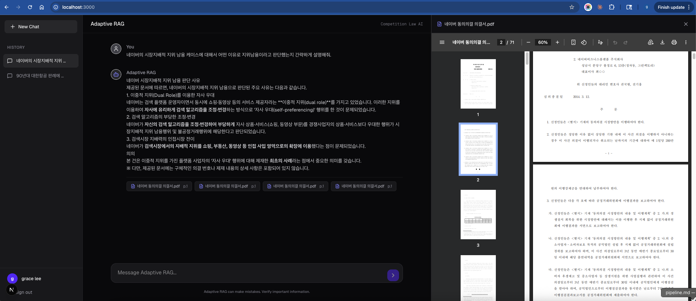

## Demo



The web UI provides a chat interface for querying Korean competition law cases with RAG system. Each answer cites its source documents as reference chips below the response; clicking a chip opens the original PDF in the right-hand document viewer.

Self-reflection for RAG is the system that reviews its own answers and decides whether to retrieve more relevant data or not.[1]
Corrective RAG is a RAG system that corrects the retrieved documents before answering.[2]
Adaptive RAG is a system that decides whether, when and how much to retrieve external information based on the input query.[3]

## Architecture

```
┌──────────┐
│  Router  │
└────┬─────┘
     ├──► [RETRIEVE] ──► [GRADE_DOCUMENTS] ──┬──► [GENERATE] ──┬──► END (useful)
     │                                       │                 ├──► [GENERATE] (hallucinated, retry)
     └──► [WEBSEARCH] ──► [GENERATE] ────────┘                 └──► [WEBSEARCH] (not useful)
```

- **Router** (`graph/chains/router.py`): Classifies the incoming question as `vectorstore` or `websearch`. Questions about Korean competition law cases are routed to the vector store; all other queries go to web search.
- **Retrieve** (`graph/nodes/retrieve.py`): Fetches top-k semantically similar document chunks from ChromaDB.
- **Grade Documents** (`graph/nodes/grade_documents.py`): Scores all retrieved documents in parallel with a batch LLM grader. Sets the `web_search` fallback flag only when no relevant documents remain.
- **Generate** (`graph/nodes/generate.py`): Synthesizes a Korean-language answer grounded in the provided documents, citing case names, ruling numbers, and dates where available. Tracks a `retry_count` to prevent infinite loops (cap: 3).
- **Hallucination Grader** (`graph/chains/hallucination_grader.py`): Verifies the generated answer is supported by the retrieved documents.
- **Answer Grader** (`graph/chains/answer_grader.py`): Verifies the generated answer actually addresses the user's question. If not useful, the system falls back to web search. If retries are exhausted, the best available answer is returned.

# How to Run

## Step 1: Environment Setup

```bash
git clone <repo-url>
cd adaptive_rag
uv sync
```

## Step 2: Configure API Keys

Copy `.env.example` to `.env` and fill in:

```
OPENROUTER_API_KEY=your_openrouter_key_here
TAVILY_API_KEY=your_tavily_key_here
LLAMA_CLOUD_API_KEY=your_llama_cloud_key_here

# Model to use via OpenRouter (default: openai/gpt-4o-mini)
OPENROUTER_MODEL=openai/gpt-4o-mini

# Required only for LlamaParse ingestion
LLAMA_CLOUD_API_KEY=your_llama_cloud_key_here

# NextAuth variables required for UI Login
NEXTAUTH_SECRET=your_random_secret_string
NEXT_PUBLIC_API_URL=http://localhost:8000
GOOGLE_CLIENT_ID=your_google_client_id
GOOGLE_CLIENT_SECRET=your_google_client_secret

# Optional: LangSmith tracing
LANGCHAIN_TRACING_V2=true
LANGCHAIN_API_KEY=your_langsmith_key_here
```

## Step 3: Data Ingestion

Place PDF files in `data/korean_competition_law_cases/`, then run:

```bash
# Default (PyPDF, no table parsing)
uv run python data/ingest.py --pdf_path=./data/korean_competition_law_cases

# With Unstructured table extraction (local, heavy deps)
uv run python data/ingest.py --table_parser=unstructured --pdf_path=./data/korean_competition_law_cases

# With LlamaParse (best table quality, requires LLAMA_CLOUD_API_KEY)
uv run python data/ingest.py --table_parser=llamaparse --pdf_path=./data/korean_competition_law_cases

# LlamaParse with custom page limit and cache directory
uv run python data/ingest.py --table_parser=llamaparse --pdf_path=./data/korean_competition_law_cases --llamaparse_page_limit=1000 --llamaparse_cache_dir=./data/llamaparse_cache
```

| Flag | Default | Description |
|---|---|---|
| `--pdf_path` | `./data/korean_competition_law_cases` | Path to PDF directory |
| `--table_parser` | `none` | `"none"` (PyPDF), `"unstructured"`, or `"llamaparse"` |
| `--llamaparse_page_limit` | `1000` | Max pages to process per run (LlamaParse only) |
| `--llamaparse_cache_dir` | `./data/llamaparse_cache` | Cache dir for resumable LlamaParse runs |

For LlamaParse, results are cached per-file — rerun to resume where you left off.

> **Note**: The ChromaDB retriever is initialized lazily on first query. If the collection is empty (ingest has never been run), the graph will raise a `RuntimeError` with instructions to run ingestion first.

See [preprocessing.md](data/preprocessing.md) for details on all preprocessing steps applied.

## Step 4: Run the Application

There are two ways to run the application depending on your environment. 

### Method A: Local Development (Without Docker)
Since you may not have Docker installed on your personal Mac, you can run the services natively using node and python:

**1. Start the Backend:**
```bash
# From the root adaptive_rag directory
uv run uvicorn main:app --port 8000
```

**2. Start the Frontend:**
Open a new terminal window:
```bash
cd frontend
npm run dev
```
Navigate to `http://localhost:3000`.

### Method B: Cloud Server Deployment (With Docker)
If you are deploying this repository to your new cloud server, make sure Docker is installed there. You can start the containerized system via:

```bash
docker compose build
docker compose up -d
```

# Generate random string
```python
import secrets
import string

# Define the pool of characters (letters and digits)
alphabet = string.ascii_letters + string.digits

# Generate a 30-character string
random_string = ''.join(secrets.choice(alphabet) for _ in range(30))

print(random_string)
```

## References

[1] Asai, Akari, et al. "Self-rag: Learning to retrieve, generate, and critique through self-reflection." The Twelfth International Conference on Learning Representations. 2023.

[2] Yan, Shi-Qi, et al. "Corrective retrieval augmented generation." (2024).

[3] Jeong, Soyeong, et al. "Adaptive-rag: Learning to adapt retrieval-augmented large language models through question complexity." Proceedings of the 2024 Conference of the North American Chapter of the Association for Computational Linguistics: Human Language Technologies (Volume 1: Long Papers). 2024.
