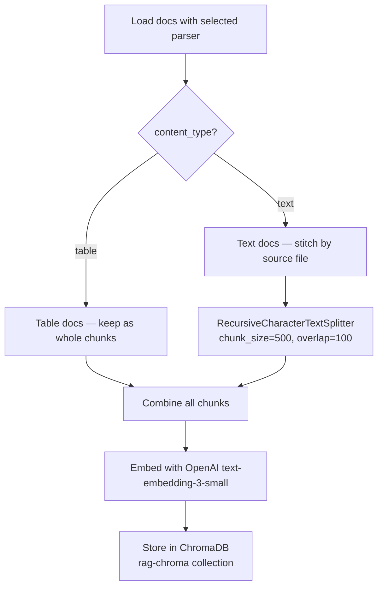

# PDF Preprocessing for Korean Competition Law Cases

## Corpus Overview

| Metric | Value |
|---|---|
| Total PDF files | 108 |
| Total pages | 3,159 |
| Files with `- N -` page number headers | 75 / 108 (69%) |
| Files with Korean character spacing artifacts | **108 / 108 (100%)** |
| Files with table-like content | 28 / 108 (26%) |
| Fully empty pages (0 chars) | 0 |
| Sparse pages (<100 chars) | 23 |
| Large files (>1MB) | 9 |

> [!IMPORTANT]
> All 108 files extract text successfully via `PyPDF`. No scanned/image-only pages were detected — OCR is **not needed**.

---

## Configuration

All preprocessing is implemented in [`ingest.py`](file:///Users/g/workspace/rag/adaptive_rag/data/ingest.py). Configure via constants at the top of the file:

```python
PDF_PATH = "/Users/g/workspace/rag/adaptive_rag/data/korean_competition_law_cases"
TABLE_PARSER = "none"          # "none" | "unstructured" | "llamaparse"
LLAMAPARSE_PAGE_LIMIT = 1000   # Max pages per run (LlamaParse only)
LLAMAPARSE_CACHE_DIR = "./data/llamaparse_cache"
```

Run with: `python data/ingest.py`

---

## Preprocessing Steps (Applied by `preprocess_page()`)

Steps 1, 2, 3, and 4 are applied to **all** parser backends via the `preprocess_page()` function.

### 1. Remove Page Number Headers (75/108 files)

69% of files have `- N -` style page numbers as the first line of every page.

```python
text = re.sub(r'^\s*-\s*\d+\s*-\s*\n?', '', text)
```

### 2. Normalize Korean Character Spacing (100% of files)

**Most impactful step.** Every file contains exaggerated character spacing:

```
공 정 거 래 위 원 회    →  공정거래위원회
전 원 회 의              →  전원회의
사 건 번 호              →  사건번호
```

This hurts embedding quality because the model sees `공 정 거 래` as four separate tokens instead of `공정거래`.

```python
# Match a run of 3+ Korean chars separated by single spaces, then collapse
run_pattern = re.compile(r'(?:[가-힣] ){2,}[가-힣]')
text = run_pattern.sub(lambda m: m.group(0).replace(' ', ''), text)
```

> [!WARNING]
> This regex targets **single-space** gaps between Korean characters only. Test on a few files to ensure legitimate phrases (e.g., `삼성 전자`) are not incorrectly merged.

### 3. Filter Out Sparse Pages

Pages with fewer than 30 characters after preprocessing (typically just page numbers or dividers) are discarded.

```python
docs = [d for d in docs if len(d.page_content.strip()) > 30]
```

### 4. Collapse Excessive Whitespace

```python
text = re.sub(r'\n{3,}', '\n\n', text)                    # 3+ newlines → 2
text = re.sub(r'[ \t]+$', '', text, flags=re.MULTILINE)   # trailing whitespace
```

---

## Table Extraction (Step 5)

Set `TABLE_PARSER` to select the backend. 26% of files contain table-like content using Unicode box-drawing characters or space-aligned columns.

#### Why Tables Are a Problem for ChromaDB

When `PyPDF` extracts a table, it reads text left-to-right, top-to-bottom, mashing column values together. The embedding model treats `본사 지점 대리점 70%` as a narrative sentence instead of structured data, producing semantically meaningless vectors.

### Approach A: Unstructured (`TABLE_PARSER = "unstructured"`)

[Unstructured](https://docs.unstructured.io/) classifies each PDF element as "Title", "NarrativeText", or "Table" and extracts tables as HTML.

**Setup:** `pip install unstructured[pdf]` + `brew install tesseract poppler`

- Tables are tagged with `content_type: "table"` and `element_type: "Table"` in metadata
- Non-table elements are tagged with `content_type: "text"`

**Pros:** Open source, runs fully locally, rich element classification.
**Cons:** Heavy dependencies (Tesseract, poppler, pytorch), slower processing.

### Approach B: LlamaParse (`TABLE_PARSER = "llamaparse"`)

[LlamaParse](https://docs.llamaindex.ai/en/stable/llama_cloud/llama_parse/) uses vision models to extract tables as clean markdown. Highest-quality option.

**Setup:** `pip install llama-parse llama-index-core` + set `LLAMA_CLOUD_API_KEY` in `.env`

**Resumable batch processing:**
- Caches each file's parsed output as JSON in `LLAMAPARSE_CACHE_DIR`
- On rerun, loads cached files instantly and only parses new ones
- Stops when cumulative pages hit `LLAMAPARSE_PAGE_LIMIT` (default 1000)
- Progress logging: `[llamaparse] Done: file.pdf — 450/1000 pages used`

**Pros:** Best table quality, handles complex merged cells, supports Korean.
**Cons:** API key required, data sent externally, free tier = 1K pages/day (~4 days for full corpus).

### Comparison

| Criteria | LlamaParse | Unstructured |
|---|---|---|
| Setup difficulty | API key only | Heavy (system deps) |
| Data privacy | API call | ✅ Local |
| Table quality | Best | Good |
| Korean support | ✅ | ✅ |
| Handles space-aligned tables | ✅ | ✅ |
| Cost | Free tier (1K pages/day) | Free |

---

## Ingestion Pipeline (Strategy 2: Separate Table Storage)

After loading, `ingest.py` uses **Strategy 2** to handle tables and text differently:



**Why Strategy 2?** Tables stored as whole unsplit chunks preserve their structure. Splitting a table across multiple chunks makes each chunk individually meaningless for retrieval. Text metadata `content_type: "table"` or `"text"` enables filtered retrieval:

```python
# Retrieve only tables
retriever = vectorstore.as_retriever(search_kwargs={"filter": {"content_type": "table"}})

# Retrieve everything (default)
retriever = vectorstore.as_retriever()
```
